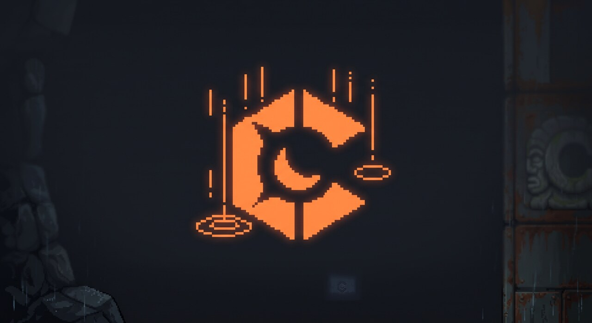

<p align="center">
  <a href="https://github.com/crateria">
    
  </a>
</p>

# Crateria brand kit

Canonical visual assets for the Crateria organization.

## Current public brand: header only

GitHub READMEs, the org profile, and the packages site use the **header banner** as the brand surface. Product icons are **deferred** until there is a clear need (org avatar, app tray icons, store listings).

**Header source of truth:** `headers/crateria-header.jpg` (also `assets/crateria-header.jpg` in this repo).

Product repos keep a **copy** at `assets/crateria-header.jpg` so README relative paths work without depending on a cross-repo CDN.

## Header

`headers/crateria-header.jpg` (1280×240) — used on product READMEs and org pages.

- **Left:** Crateria C (oversized, cropped top/bottom)
- **Right:** rusted environment from the original scenic art
- One continuous frame (not two images spliced mid-banner)


## Installing the header into product repositories

| Target | Copy |
|--------|------|
| All product READMEs | `headers/crateria-header.jpg` → `assets/crateria-header.jpg` |
| [crateria/crateria](https://github.com/crateria/crateria) | → `assets/crateria-header.jpg` |
| [.github](https://github.com/crateria/.github) | → `crateria-header.jpg` (repo root + `profile/`) |

README pattern (header only — no product icon block):

```html
<p align="center">
  <a href="https://github.com/crateria">
    
  </a>
</p>

# Product name
```

## Other assets (not used on GitHub right now)

| Path | Status |
|------|--------|
| `marks/`, `repo/` | Legacy / experimental product marks — not shown on READMEs |
| `heroes/` | Marketing stills — optional, not wired into READMEs |
| `assets/` | Duplicate header + optional copies |

Do not install product icons into READMEs or the org profile until branding decides otherwise.

## Design notes

| Token | Value |
|-------|--------|
| Accent | `#ff8541` |
| Background | `#0b0d0f` – `#121216` |

## License

[Apache-2.0](LICENSE) · Copyright 2026 Crateria
