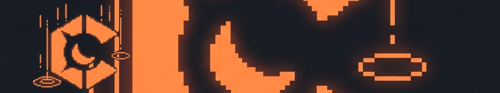
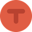

<p align="center">
  <a href="https://github.com/crateria">
    
  </a>
</p>

<p align="center">
  
</p>

# Crateria brand kit

Canonical visual assets for the Crateria organization.

**Header source of truth:**  (and ).
Product repos keep a **copy** under  so README relative paths work without depending on GitHub CDN cache.

## Header preview

`headers/crateria-header.jpg` (1280×240) — used on product READMEs.

- **Left:** Crateria C (oversized, cropped top/bottom)
- **Right:** rusted environment from the original scenic art
- One continuous frame (not two images spliced mid-banner)


Full mark (uncropped):

<p align="center">
  
</p>


Canonical visual assets for the Crateria organization. Product repositories ship only the icons they need; this repository keeps masters, size ladders, and marketing sources.


## Standard product icons

UberMetroid-style flat marks — identical for every product:

| Spec | Value |
|------|--------|
| Shape | Circle on transparent square (512×512 PNG) |
| Fill | Solid coral `#E05D44` |
| Symbol | Simple monochrome silhouette, darker `#B84230` |
| Format | PNG (+ SVG embed of the same PNG) |


## Marks

| Asset | Used for |
|-------|----------|
|  **crateria** | Organization mark, packages site, umbrella branding |
|  **trance** | Screensaver application |
|  **trance-plugins** | Effect suite |
|  **morphball** | Archive manager |

## Directory layout

```
headers/  README banner (crateria-header.jpg) for all product repos
marks/    Transparent PNG masters (1024×1024) and size ladder (32–512)
          plus *-on-dark.jpg previews
heroes/   Wide and scenic marketing stills
repo/     Install-ready 512×512 PNG and PNG-embedded SVG
          including crateria-org-avatar.png
```

## Installing into product repositories

| Target | Copy from `repo/` |
|--------|-------------------|
| [trance](https://github.com/crateria/trance) | `trance.png` → `assets/icon.png`, `trance.svg` → `assets/icon.svg` (also applet `resources/icon.png`) |
| [morphball](https://github.com/crateria/morphball) | `morphball.png`, `morphball.svg` → `assets/` |
| [trance-plugins](https://github.com/crateria/trance-plugins) | `trance-plugins.png`, `trance-plugins.svg` → `assets/` |
| [packages](https://github.com/crateria/packages) | `crateria.png` → `assets/icon.png` |
| All product READMEs | `headers/crateria-header.jpg` → `assets/crateria-header.jpg` |
| Organization avatar | `crateria-org-avatar.png` → GitHub org **Settings → Profile picture** |
| [.github profile](https://github.com/crateria/.github) | PNG marks under `profile/icons/` |

## Design notes

| Token | Value |
|-------|--------|
| Accent | `#ff8541` |
| Background | `#0b0d0f` – `#121216` |
| Style | Pixel / CRT glow, isometric marks |

Prefer transparent PNG for UI. JPEG under `heroes/` is for marketing only.
SVG files in `repo/` embed PNG for README compatibility; a hand-traced vector
set may replace them later.

## License

[Apache-2.0](LICENSE) · Copyright 2026 Crateria
